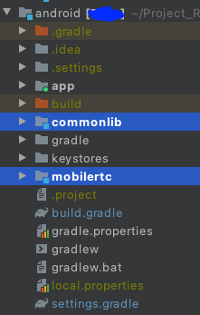
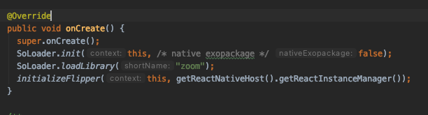

# reactnative-zoomsdk-android-exclusive - v5.4.3.613
fix conflict with libc++_shared.so between ZoomSDK and ReactNative (other that has libc++_shared.so works) on Android

- Your app crashes when trying to run `zoomSDK.initialize`?
- Run Android and receive `More than one file was found with OS independent path 'lib/x86/libc++_shared.so'` ?
- You watched logcat and find something like `ibc++abi: terminating with uncaught exception of type std::bad_cast: std::bad_cast`
- -> this is what you need

## Quick step
1. follow official docs: https://marketplace.zoom.us/docs/sdk/native-sdks/android/getting-started/install-sdk
2. download this and extract all `zip` file
3. replace official SDK by this

3. go to `MainApplication` and add `SoLoader.loadLibrary("zoom")`

# Distribution
Thanks for our hero: 
- https://www.reddit.com/r/reactnative/comments/l45uib/conflicting_native_shared_object_libc_sharedso/
- https://stefanmajiros.medium.com/how-to-integrate-zoom-sdk-into-react-native-47492d4e46a6